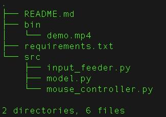

# Computer Pointer Controller

*TODO:* Write a short introduction to your project

This app uses a gaze detection model to control the mouse pointer of your computer. This model is called Gaze Estimation model and it is used to estimate the gaze of the user's eyes and change the mouse pointer position accordingly. 

Besides this, there are other three models involved to detect faces, head pose and landmarks.

## Project Set Up and Installation
*TODO:* Explain the setup procedures to run your project. For instance, this can include your project directory structure, the models you need to download and where to place them etc. Also include details about how to install the dependencies your project requires.

To develop this app my system features were:

- Mac OSX Catalina 10.15.5
- 2.9 GHz Dual-Core Intel Core i7
- 8 GB RAM 1600 Mhz DDR3
- Intel HD Graphics 4000 1536 MB
- openVINO toolkit 2020.3
- python 3.5.5

### Directory structure

  

#

First of all you need to install the latest version of the [openVINO toolkit](https://docs.openvinotoolkit.org/latest/index.html).

Clone this repo.

All the code presented hereafter must be entered within a terminal window.

Creating a virtual environment using venv:

virtualenv is a tool to create isolated Python environments.

Install it via pip:

$ pip3 install virtualenv

Create a new dntain your environments:

$ mkdir python-virtual-environments

$ cd <PATH for python-virtual-environments> 

Create a virtual environment:
 
$ virtualenv name_env
 
Activate the virtual environment:

$ source name_env/bin/activate 

Deactivate the virtual environment:

$ deactivate

Get all the dendencies up and running:

$ cd <PATH for app directory>

$ pip3 install -r requirements.txt

Set the Toolkit's Environment Variables:

$source /opt/intel/openvino/bin/setupvars.sh

## Demo
*TODO:* Explain how to run a basic demo of your model.

In order to run the app just fill the arguments required as explained in the next section. Here a video showing what you are suppose to see once the entered command is successful.

## Documentation
*TODO:* Include any documentation that users might need to better understand your project code. For instance, this is a good place to explain the command line arguments that your project supports.

model.py: Contains a class to load, process and run inference on the models used during the project.

input_feeder: contains a class to get imput from a videofile or camera.

mouse_controller: Contains the code used by the module PyautoGUI which automates tasks in multiple operating systems. "Automate" is generally understood as controlling the mouse and keyboard, although in this particular case other tools such as dialog boxes and screenshots are included. 

demo.mp4: This is the video provided for the demo run.

## Benchmarks
*TODO:* Include the benchmark results of running your model on multiple hardwares and multiple model precisions. Your benchmarks can include: model loading time, input/output processing time, model inference time etc.

## Results
*TODO:* Discuss the benchmark results and explain why you are getting the results you are getting. For instance, explain why there is difference in inference time for FP32, FP16 and INT8 models.

## Stand Out Suggestions
This is where you can provide information about the stand out suggestions that you have attempted.

### Async Inference
If you have used Async Inference in your code, benchmark the results and explain its effects on power and performance of your project.

### Edge Cases
There will be certain situations that will break your inference flow. For instance, lighting changes or multiple people in the frame. Explain some of the edge cases you encountered in your project and how you solved them to make your project more robust.
