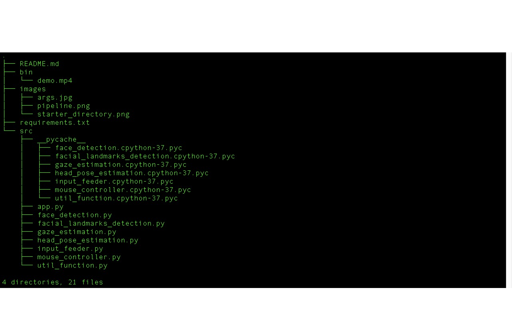
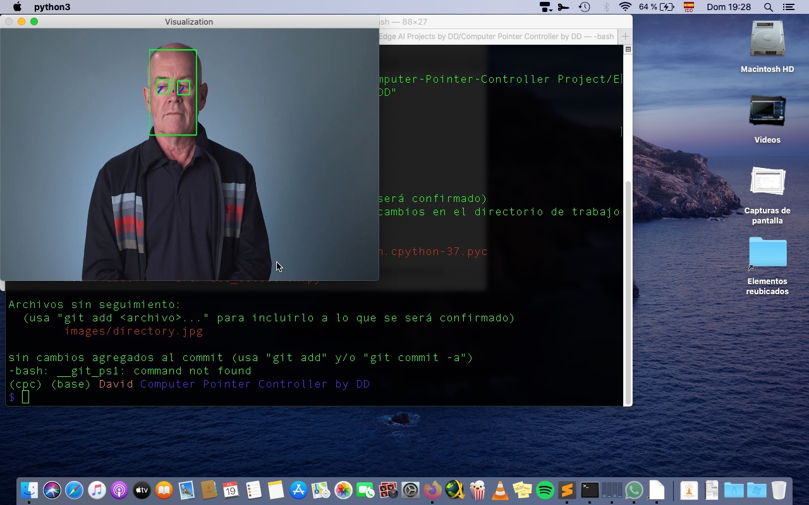
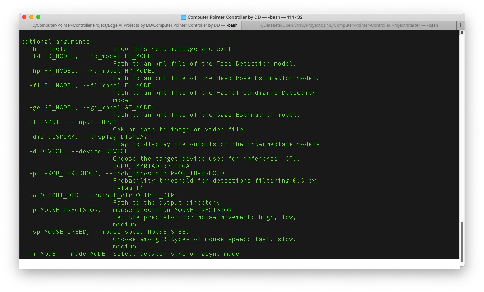

# Computer Pointer Controller

## Content 

- [Overview](#overview)
- [Project Set up and Installation](#project-set-up-and-installation)
- [Directory Structure](#directory-structure)
- [Demo](#demo)
- [Documentation](#documentation)
- [Benchmarks](#benchmarks)
- [Results](#results)

*TODO:* Write a short introduction to your project

## Overview
This app uses a gaze detection model to control the mouse pointer of your computer. This model is called Gaze Estimation model and it is used to estimate the gaze of the user's eyes and change the mouse pointer position accordingly. 

Besides this, there are other three models involved to detect faces, head pose and landmarks. The pipeline workflow is showned as follows:

## Project Set Up and Installation

*TODO:* Explain the setup procedures to run your project. For instance, this can include your project directory structure, the models you need to download and where to place them etc. Also include details about how to install the dependencies your project requires.

To develop this app my system features were:

- Mac OSX Catalina 10.15.5
- 2.9 GHz Dual-Core Intel Core i7
- 8 GB RAM 1600 Mhz DDR3
- Intel HD Graphics 4000 1536 MB
- openVINO toolkit 2020.3
- python 3.5.5

## Directory structure

  

- bin/demo.mp4: This is the video provided for the demo run.

- images/: Folder containing the images used for this readme file.

- requirements.txt: File containing all the dependecies needed to run this app properly.

- src/: Project folder containing all the scripts for the app.

- pycache/: Folder containing files sharing the names of the .py files in the project's folder, only their extensions will be either .pyc or .pyo. 
What these files do is make the app start a little faster. When the scripts change, they will be recompiled, and if you delete the files or the whole folder and run your program again, they will reappear (unless you specifically suppress that behavior). 

-app.py: Python file conecting all the modules and classes that are called for the app to execute properly. 

- model.py: Contains a class to load, process and run inference on the models used during the project. One for each model used e.g. 4 in this case.

- input_feeder: contains a class to get imput from a videofile or camera.

- mouse_controller: Contains the code used by the module PyautoGUI which automates tasks in multiple operating systems. "Automate" is generally understood as controlling the mouse and keyboard, although in this particular case other tools such as dialog boxes and screenshots are included. 

-util_function.py: module containing code for image preprocessing.

## Demo

*TODO:* Explain how to run a basic demo of your model.

In order to run the app just fill the arguments required as explained in the next section: 

First of all you need to install the latest version of the [openVINO toolkit](https://docs.openvinotoolkit.org/latest/openvino_docs_install_guides_installing_openvino_macos.html).

Clone this repo.

All the code presented hereafter must be entered within a terminal window.

Creating a virtual environment using venv:

virtualenv is a tool to create isolated Python environments.

- Install it via pip:

$ pip3 install virtualenv

- Create a new dntain your environments:

$ mkdir python-virtual-environments

$ cd PATH for python-virtual-environments 

- Create a virtual environment:
 
$ virtualenv name_env
 
- Activate the virtual environment:

$ source name_env/bin/activate 

- Set the Toolkit's Environment Variables:

$ source /opt/intel/openvino/bin/setupvars.sh

- To download the models run the following:

$ cd /opt/intel/openvino/deployment_tools/open_model_zoo/tools/downloader

- Download face detection model:

$ ./downloader.py --name face-detection-adas-binary-0001 

- Download head_pose_estimation model:

$ ./downloader.py --name head-pose-estimation-adas-0001

- Download facial landmarks detection model:

$ ./downloader.py --name landmarks-regression-retail-0009

- Download gaze estimation model:

$ ./downloader.py --name gaze-estimation-adas-0002

- Get all the dendencies up and running:

$ cd PATH for app directory

$ pip3 install -r requirements.txt

To run the app in different precisions the code should be run as follows:

- For FP16

python3 src/app.py \
-fd models/intel/face-detection-adas-binary-0001/INT1/face-detection-adas-binary-0001.xml \
-hp models/intel/head-pose-estimation-adas-0001/FP16/head-pose-estimation-adas-0001.xml \
-fl models/intel/landmarks-regression-retail-0009/FP16/landmarks-regression-retail-0009.xml \
-ge models/intel/gaze-estimation-adas-0002/FP16/gaze-estimation-adas-0002.xml\
-i bin/demo.mp4 -d CPU -o ./output

- For FP32

python3 src/app.py \
-fd models/intel/face-detection-adas-binary-0001/INT1/face-detection-adas-binary-0001.xml \
-hp models/intel/head-pose-estimation-adas-0001/FP32/head-pose-estimation-adas-0001.xml \
-fl models/intel/landmarks-regression-retail-0009/FP32/landmarks-regression-retail-0009.xml \
-ge models/intel/gaze-estimation-adas-0002/FP32/gaze-estimation-adas-0002.xml\
-i bin/demo.mp4 -d CPU -o ./output

-For INT8

python3 src/app.py \
-fd models/intel/face-detection-adas-binary-0001/INT1/face-detection-adas-binary-0001.xml \
-hp models/intel/head-pose-estimation-adas-0001/FP32/head-pose-estimation-adas-0001.xml \
-fl models/intel/landmarks-regression-retail-0009/FP32/landmarks-regression-retail-0009.xml \
-ge models/intel/gaze-estimation-adas-0002/INT8/gaze-estimation-adas-0002.xml\
-i bin/demo.mp4 -d CPU -o ./output

- After running the app you can deactivate the virtual environment:

$ deactivate

## Documentation
*TODO:* Include any documentation that users might need to better understand your project code. For instance, this is a good place to explain the command line arguments that your project supports.

## Benchmarks
*TODO:* Include the benchmark results of running your model on multiple hardwares and multiple model precisions. Your benchmarks can include: model loading time, input/output processing time, model inference time etc.

- **INT8**

Total model loading time: 9.48 s

Total inference time: 135.56 s

- **FP16** 

Total model loading time: 6.95 s

Total inference time: 110.61 s

- **FP32**

Total model loading time: 6.31 s

Total inference time: 100.27 s

## Results
*TODO:* Discuss the benchmark results and explain why you are getting the results you are getting. For instance, explain why there is difference in inference time for FP32, FP16 and INT8 models.

- FP32 refers to single-precision (32-bit) floating point format, a number format that can represent an enormous range of values with a high degree of mathematical precision. Most CPUs and GPUs handle 32-bit floating point operations very efficiently, and many programs that use neural networks set FP32 precision by default.

- FP16 refers to half-precision (16-bit) floating point format, a number format that uses half the number of bits as FP32 to represent a model’s parameters. FP16 is a lower level of precision than FP32, but it still provides a great enough numerical range to successfully perform many inference tasks. FP16 often requires less time than FP32, and uses less memory.

- INT8 refers to the 8-bit integer data type. INT8 data is better suited for certain types of calculations than floating point data, but it has a relatively small numeric range compared to FP16 or FP32. Depending on the model, INT8 precision can significantly improve latency and throughput, but there may be a loss of accuracy. INT8 precision does not always trade accuracy for speed. 

As expected the best performance has been displayed when using a FP32 precision, both loading and inference time are the lowest.

In case of the FP16 precision, although timing should appear less than when using FP32 we get quite similar values perhaps due to the face detection model being available only as INT1.

INT8 precision showed the higest loss of accuracy and thus the longest inference time.

Whevever you run the models using this precisions you should get similar values to the ones presented above.

Thank you for trying out the app!

